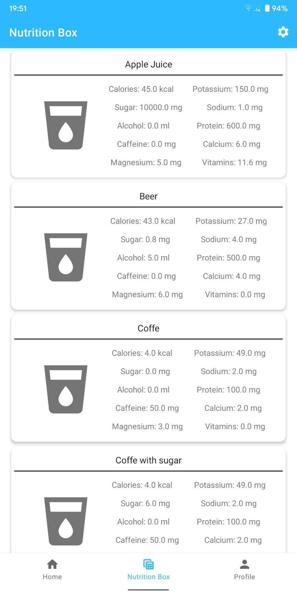

**Hydrate APP**

This is an app that I made for University as a final project for mobile terminal programming classes. 

The core idea behind the app is measuring how many liquids user have drunk during the day. User input different liquids that were firstly created in Firebase Realtime Database. Usage of firebase was one of a requirement from the instructor. User is able to input drinks with different capacity. Every drink has defined its own nutrients. Before using the app, user have to create simple and secure account based on email, which uses Firebase Authentication. After that, the user can set up a goal of how many liquids they want to drink every day and add liquids. User can also check nutrients for every drink, delete past inputs, check how many goals user achieved during the week, set reminders to drink water, set cup sizes, manage user profile (change weight, height, name).

Screenshots presents homescreen (1 and 2), Nutrition Box screen with nutrients from every added drink (3) and simple settings (4).

 

 

